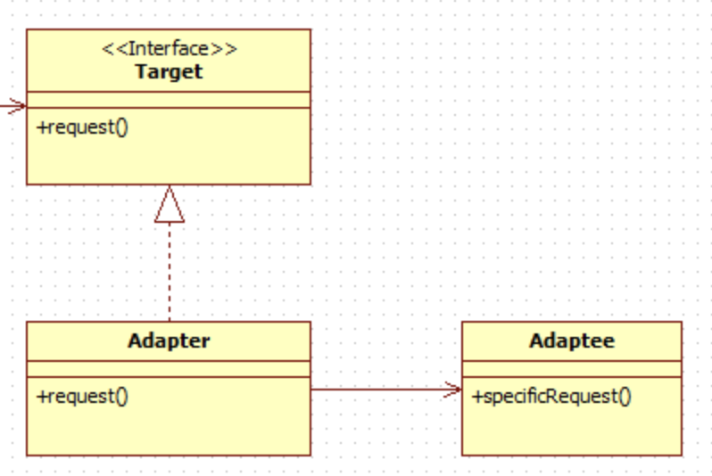

## **어댑터 패턴(Adapter Pattern)**
호환되지 않는 인터페이스들을 연결하는 디자인 패턴

### 어댑터 패턴의 종류
- 객체 어댑터 : 단일 상속을 활용해 구현
- 클래스 어댑터 : 다중 상속을 활용해 구현

#### 어댑터 패턴을 사용하면?
- 기존의 클래스를 수정하지 않고, 특정 인터페이스로 변환해서 사용할 수 있게 해준다.
- 서로 다른 인터페이스를 가진 클래스들이 상호작용할 수 있도록 해 코드의 재사용성이 높아진다.

### 어댑터 패턴의 구성 요소
- 타겟(Target) : 클라이언트가 직접적으로 호출하는 인터페이스
- 어댑티(Adaptee) : 아직 호환되지 않은 기존 클래스
- 어댑터(Adpater) : 타겟 인터페이스를 구현하여 클라이언트 요청을 어댑티로 전달하는 클래스



### 예제 코드 (책 - Headfirst Design Pattern 참조)
```java
// Duck Package
public interface Duck {
    public void quack();
    public void fly();
}

public class MallardDuck implements Duck {
    public void quack() {
        System.out.println("꽥");
    }

    public void fly() {
        System.out.println("날고 있어요!");
    }
}
```
```java
// Turkey Package
public interface Turkey {
    public void gobble(); // 칠면조는 꽥꽥거리지 않습니다. 골골거리는 소리를 내요!
    public void fly(); // 칠면조도 날 수 있긴 합니다. 멀리 날지는 못하지만요!
}

public class WildTurkey implements Turkey {
    public void gobble() {
        System.out.println("골골");
    }

    public void fly() {
        System.out.println("짧은 거리를 날고 있어요!");
    }
}
```

### Duck 객체가 모자라서 Turkey 객체를 대신 사용해야 하는 상황이라고 가정
인터페이스가 달라서 Turkey 객체를 바로 사용할 수 없어, 어댑터를 만든다.

```java
public class TurkeyAdapter implements Duck {
    Turkey turkey;

    public TurkeyAdapter(Turkey turkey) {
        this.turkey = turkey;
    }

    public void quack() {
        turkey.goggle();
    }

    public void fly() {
        for(int i = 0; i < 3; i++) {
            turkey.fly(); // 터키는 오리처럼 멀리 날지 못해요!
        }
    }
}
```

#### 메인 함수
```java
public class Main {
    public static void main(String[] args) {
        Duck duck = new MallardDuck();

        Turkey turkey = new WildTurkey();
        Duck turkeyAdapter = new TurkeyAdapter(turkey);

        System.out.println("칠면조가 말하길");
        turkey.gobble();
        turkey.fly();

        System.out.println("\n오리가 말하길");
        testDuck(duck);

        System.pout.println("\n칠면조 어댑터가 말하길");
        testDuck(turkeyAdapter);
    }

    static void testDuck(Duck duck) {
        duck.quack();
        duck.fly();
    }

    // 출력결과
    칠면조가 말하길
    골골
    짧은 거리를 날고 있어요!

    오리가 말하길
    꽥
    날고 있어요!

    칠면조 어댑터가 말하길
    골골
    짧은 거리를 날고 있어요!
    짧은 거리를 날고 있어요!
    짧은 거리를 날고 있어요!
}
```