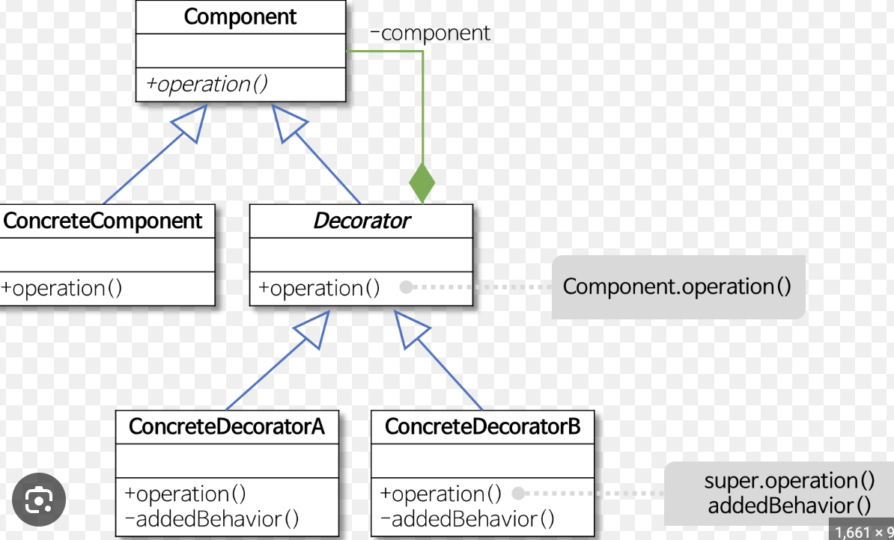

## **데코레이터 패턴(Decorator Pattern)**
객체에 추가 요소를 동적으로 더할 수 있다.

### 데코레이터 패턴을 사용하면?
- 서브 클래스를 만들 때보다 훨씬 유연하게 기능을 확장할 수 있다.


### 데코레이터 패턴의 구성 요소
- 컴포넌트(Component)
- 컴포넌트구현체(ConcreteComponent) ...
- 데코레이터(Decorator)
- 데코레이터 구현체 A(ConcreteDecorator A)
- 데코레이터 구현체 B(ConcreteDecorator B) ...

### 예제
<table>
    <tr>
        <th>Just Implementation </th>
        <th> </th>
        <th>Apply Decorator </th>
    </tr>
    <tr>
        <th>
            
        </th>
        <th> </th>
        <th>
            
        </th>
    </tr>
</table>

<br/><br/>

```java
public abstract class Beverage {
    String description = "제목 없음";

    public String getDescription() {
        return description;
    }

    public abstract double cost();
}

public abstract class CondimentDecorator extends Beverage {
    Beverage beverage;
    public abstract String getDescription();
}
```

<br/><br/>

#### 음료 코드
```java
public class Espresson extends Beverage {
    public Espresso() {
        description = "에스프레소";
    }
    public double cost() {
        return 1.99;
    }
}

public class HouseBlend extends Beverage {
    public Espresso() {
        description = "하우스 블렌드 커피";
    }
    public double cost() {
        return .89;
    }
}
```

#### 첨가물 코드
```java
public class Mocha extends CondimentDecorator {
    public Mocha(Beverage beverage) {
        this.beverage = beverage;
    }

    public String getDescription() {
        return beverage.getDescription() + ", 모카";
    }

    public double cost() {
        return beverage.cost() + .20;
    }
}

public class Whip extends CondimentDecorator {
    ...
}
```

#### 메인 코드
```java
public class StarbuzzCoffee {
    public static void main(String[] args) {
        Beverage beverage = new Espresso();
        System.out.println(beverage.getDescription() + "$" + beverage.cost());

        Beverage beverage2 = new DarRoast();
        beverage2 = new Mocha(beverage2);
        beverage2 = new Mocha(beverage2);
        beverage2 = new Whip(beverage2);

        System.out.println(beverage2.getDescription() + "$" + beverage2.cost());
    }

    //출력결과
    //에스프레소 $1.99
    //다크 로스트 커피, 모카, 모카, 휘핑크림 $1.49
}
```