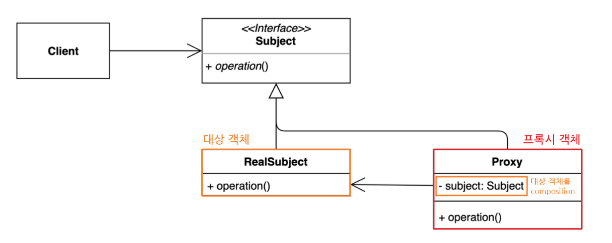

## **프록시 패턴(Proxy Pattern)**
복잡한 서브 클래스들의 공통적인 기능을 정의하는 상위 수준의 인터페이스를 제공하는 패턴

### 프록시 패턴을 사용하면?
- 공통적인 기능을 원본 코드를 수정 없이 확장할 수 있다.
- 보안, 캐싱, 데이터 유효성 검사, 지연 초기화, 로깅, 원격 객체등 다양한 상황에 사용할 수 있다.

### 프록시 패턴의 종류
- 기본 프록시 : 객체를 사용할 때, 추가적으로 필요한 동작을 수행하는 프록시
- 원격 프록시 : 원격 서버에 존재하는 객체를 로컬 객체처럼 사용하는 프록시
- 가상 프록시 : 객체가 실제로 필요한 시점에 초기화하는 프록시 (= 지연 프록시)

### 어댑터 패턴의 구성 요소
- 주체(Subject) : Proxy와 RealSubject를 하나로 묶는 인터페이스
- 원본 객체(RealSubject) : 원본 객체
- 프록시(Proxy) : 원본 객체를 중계할 대리자 역할




### 예제 (기본 프록시)
```java
interface ISubject {
    void action();
}

class RealSubject implements ISubject {
    public void action(Object arg) {
        System.out.println("원본 객체 액션 !!" + arg);
    }
}

class Proxy implements ISubject {
    private RealSubject subject;

    Proxy(RealSubject subject) {
        this.subject = subject;
    }

    public void action(Object arg) {
        // doSomeThing (ex. 로깅 작업, 권한 체크, 데이터 유효성 검사, 캐싱)
        
        System.out.println("arg = " + arg);
        if(isValid(arg)) {
            subject.action();
        }
        
        System.out.println("프록시 객체 액션 !!");
    }
}
```