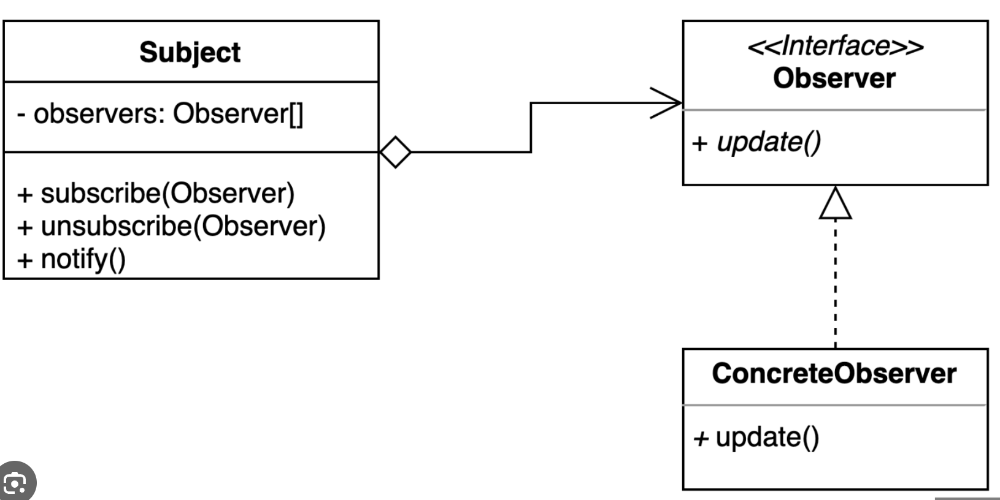
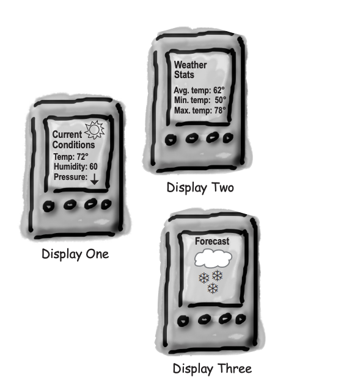

## **옵저버 패턴(Observer Pattern)**
한 객체의 상태가 바뀌면 그 객체에 의존하는 다른 객체에게 연락이 가고 자동으로 내용이 갱신되는 방식으로 일대다 의존성을 정의하는 패턴

#### 옵저버 패턴을 사용하면?
- 주제나 옵저버가 달라져도 서로에게 영향을 끼치지 않습니다. (= 느슨한 결합으로 확장 가능)

### 옵저버 패턴의 구성 요소
- 주제(Subject) : 관찰 대상자를 정의하는 인터페이스
- 옵저버(Observer) : 구독자들을 묶는 인터페이스
- 옵저버 구현체(ConcreteObserver) : 구독자의 구현체


### 예제 (책 - Headfirst Design Pattern 참조)
WetherData는 기상청에서 데이터를 받아와서, 여러 디스플레이에 값을 변경해준다고 가정해봅시다.
또, 모든 디스플레이는 기온, 습도, 기압이 필요하다고 가정해봅니다.
- 디스플레이1 (CurrentConditionsDisplay) : 현재, 기온을 보여주는 디스플레이
- 디스플레이2 (StatisticsDisplay) : 기상 통계를 보여주는 디스플레이
- 디스플레이3 (ForecastDisplay) : 기상 예보를 보여주는 디스플레이



### 옵저버 패턴 적용 전
```java
public class WeatherData {
    
    // ...

    public void measurementsChanged() {
        float temp = getTemperature();
        float humidity = getHumidity();
        float pressure getPressue();

        currentConditionsDisplay.update(temp, humidity, pressure);
        statisticsDisplay.update(temp, humidity, pressure);
        forecastDisplay.update(temp, humidity, pressure);
    }
}
```
만약, 디스플레이가 늘어난다면, WeatherData의 코드를 수정해야합니다.
만약, 디스플레이에 업데이트해야 하는 데이터가 늘어난다면, WeatherData의 코드를 수정해야 합니다.

### 옵저버 패턴 적용 후
```java
public interface Subject {
    void registerObserver(Observer o);
    void removeObserver(Observer o);
    void notifyObservers();
}

public interface Observer {
    void update();
}

public interface DisplayElement {
    void display();
}
```
위 코드는 옵저버에 베이스가 되는 인터페이스 입니다. <br/>
모든 디스플레이는 Observer와 DisplayElement를 구현해야 합니다.

```java
public class WeatherData implements Subject {
    private List<Observer> observers = new ArrayList<>();
    private float temperature;
    private float humidity;
    private float pressure;

    public void registerObserver(Observer o) {
        observers.add(o);
    }

    public void removeObserver(Observer o) {
        observers.remove(o);
    }

    public void notifyObservers() {
        for(Observer observer : observers) {
            observer.update();
        }
    }

    public void measurementsChanged() {
        notifyObservers();
    }

    public void setMeasurements(float temperature, float humidity, float pressure) {
        this.temperature = temperature;
        this.humidity = humidity;
        this.pressure = pressure;
        measurementsChanged();
    }
}

public class CurrentConditionsDisplay implements Observer, DisplayElement {
    private float temperature;
    private float humidity;

    public CurrentConditionsDisplay(WeatherData weatherData) {
        this.weatherData = weatherData;
        weatherData.registerObserver(this);
    }

    public void update() {
        this.temperature = weatherData.getTemperature();
        this.humidity = weatherData.getHumidity();
        display();
    }

    public void display() {
        System.out.println("현재 상태: 온도 + " temperature + "F, 습도 " + humidity + "%");
    }
}
```

### 메인 함수
```java
public class WeatherStation {
    public static void main(String[] args) {
        WeatherData weatherDate = new WeatherData();

        DisplayElement currentDisplay = new 
        CurrentConsitionsDisplay(weatherData);
        DisplayElement statisticsDisplay = new 
        StatisticsDisplay(weatherData);
        DisplayElement currentDisplay = new 
        ForecastDisplay(weatherData);

        weatherData.setMeaurements(80, 65, 30.4f);
        weatherData.setMeaurements(82, 70, 29.2f);
        weatherData.setMeaurements(78, 90, 29.2f);
    }
}

// 출력 결과
/*
        현재 상태: 온도 80F, 습도 65.0%
        평균/최고/최저 온도 = 80.0/80.0/80.0
        기상 예보: 날씨가 좋자이고 있습니다!
        현재 상태: 온도 82F, 습도 70.0%
        평균/최고/최저 온도 = 81.0/82.0/80.0
        기상 예보: 쌀쌀하며 비가 올 것 같습니다.
        현재 상태: 온도 78.0F, 습도 90.0%
        평균/최고/최저 온도 = 80.0/82.0/78.0
        기상 예보: 지금과 비슷할 것 같습니다.
*/
```