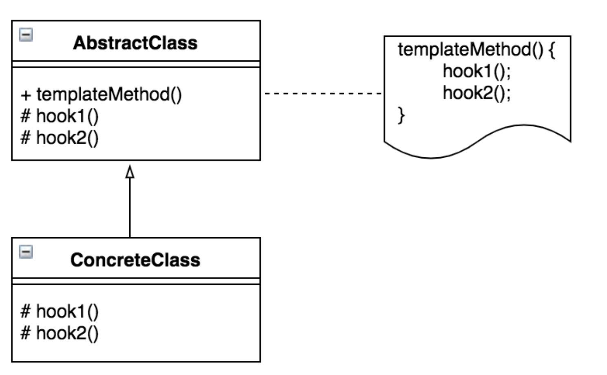

## **템플릿 메서드 패턴(Template Method Pattern)**
알고리즘의 골격을 정의하는 디자인 패턴

#### 어댑터 패턴을 사용하면?
- 알고리즘의 일부 단계를 서브클래스에서 구현할 수 있다.
- 알고리즘의 구조는 그대로 유지하면서 알고리즘의 특정 단계를 서브클래스에서 재정의할 수 도 있다.

### 어댑터 패턴의 구성 요소
- 추상 클래스(Abstract Class) : Abstract메소드로 선언된 단계들이 템플릿 메소드에 활용된다.
- 구현 클래스(Concrete Class) : 추상 클래스를 구현한 클래스


### 예제 (책 - Headfirst Design Pattern 참조)
### 템플릿 메서드 적용 전
```java
public class Coffee {
    void prepareRecipe() {
        boilWater();
        brewCoffeeGrinds();
        pourInCup();
        addSugarAndMilk();
    }

    public void boilWater() {
        System.out.println("물 끓이는 중");
    }

    public void brewCoffeeGrinds() {
        System.out.println("필터로 커피를 우려내는 중");
    }

    public void pourInCup() {
        System.out.println("컵에 따르는 중");
    }

    public void addSugarAndMilk() {
        System.out.println("설탕과 우유를 추가하는 중");
    }
}

public class Tea {
    void prepareRecipe() {
        boilWatre();
        steepTeaBag();
        pourInCup();
        addLemon();        
    }

    public void boilWater() {
        System.out.println("물 끓이는 중");
    }

    public void steepTeaBag() {
        System.out.println("찻잎을 우려내는 중");
    }

    public void pourInCup() {
        System.out.println("컵에 따르는 중");
    }

    public void addLemon() {
        System.out.println("레몬을 추가하는 중");
    }
}
```

위 코드를 보면, 커피와 티 클래스는 boilWatre()과 pourInCup()의 동작이 같습니다. <br/>

### 템플릿 메서드 적용 후
```java
public abstract class CaffeineBeverage {
    final void prepareRecipe() {
        boilWater();
        brew();
        pourInCup();
        addCondiiments();
    }

    abstract void brew();

    abstract void addCondiments();

    void boilWater() {
        System.out.println("물 끓이는 중");
    }

    void pourInCup() {
        System.out.println("컵에 따르는 중");
    }
}

public class Tea extends CaffeineBeverage {
    public void brew() {
        System.out.println("찻잎을 우려내는 중");
    }

    public void addCondiments() {
        System.out.println("레몬을 추가하는 중");
    }
}

public class Coffee extends CaffeineBeverage {
    public void brew() {
        System.out.println("필터로 커피를 우려내는 중");
    }

    public void addCondiments() {
        System.out.println("설탕과 우유를 추가하는 중");
    }
}
```