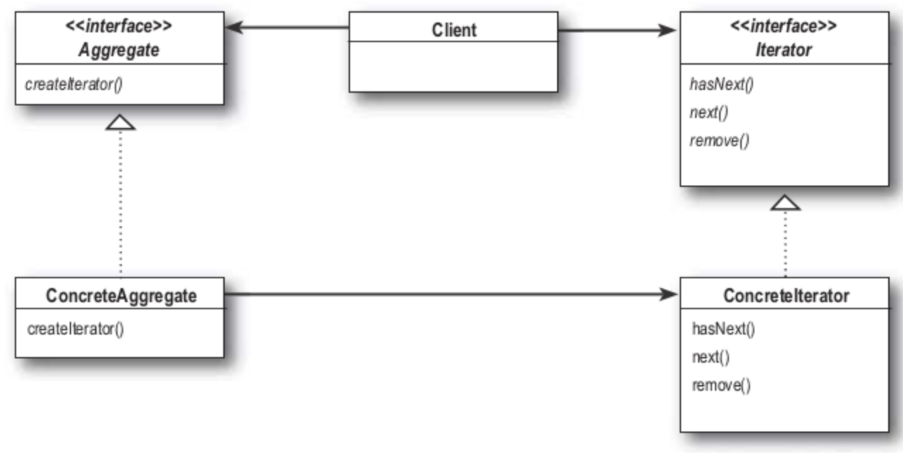

## **이터레이터 패턴(Iterator Pattern)**
컬렉션의 구현 방법을 노출하지 않으면서 집합체 내의 모든 항목에 접근하는 방법을 제공

#### 이터레이터 패턴을 사용하면?
- 집합체 내에서 어떤 식으로 일이 처리되는지 전혀 모르는 상태에서, 모든 항목을 대상으로 반복 작업을 수행할 수 있다.

### 이터레이터 패턴의 구성 요소
- 이터레이터(Iterator) : 모든 반복자(=집합체, 컬렉션)가 구현해야 하는 인터페이스를 제공
- 집합체(Aggregate) : ConcreateIterator 객체를 반환하는 인터페이스를 제공




### 예제 (책 - Headfirst Design Pattern 참조)
```java
public interface Iterator<T> {
    boolean hasNext();
    T next();
}
```

### 사용예제
```java
public class DinerMenuIterator implemnts Iterator<MenuItem> {
    MenuItem[] items;
    int position = 0;

    public DinerMenuIterator(MenuItem[] items) {
        this.items = items;
    }

    public MenuItem next() {
        return items[position++];
    }

    public boolean hasNext() {
        if(position >= items.length || items[position] == null) {
            return false
        }
        return true;
    }
}

public class DinerMenu {
    static final int MAX_ITEMS = 6;
    int numberOfItems = 0;
    MenuItem[] menuItems;

    //...

    public Iterator createIterator() {
        return new DinerMenuIterator(menuItems);
    }
}

public class PanCakeHouseMenu {
    static final int MAX_ITEMS = 6;
    int numberOfItems = 0;
    List<MenuItem> menuItems;

    //...

    public Iterator createIterator() {
        return menuItems.iterator();
    }
}

public class Waitress {
    DinerMenu dinerMenu;
    PanCakeHouseMenu panCakeHouseMenu;
    // ...

    public void printMenu() {
        Iterator dinerIterator = dinerMenu.createItreator();
        Iterator panCakeIterator = panCakeHouseMenu.createIterator();

        printMenu(dinerIterator);
        printMenu(panCakeIterator);
    }

    private void printMenu(Iterator iterator) {
        while(iterator.hasNext()) {
            MenuItem menuItem = iterator.next();
            System.out.print(menuItem.getName());
        }
    }
}
```

