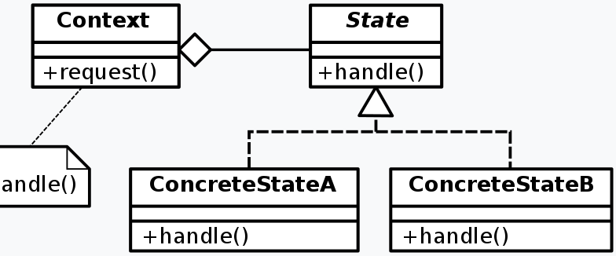
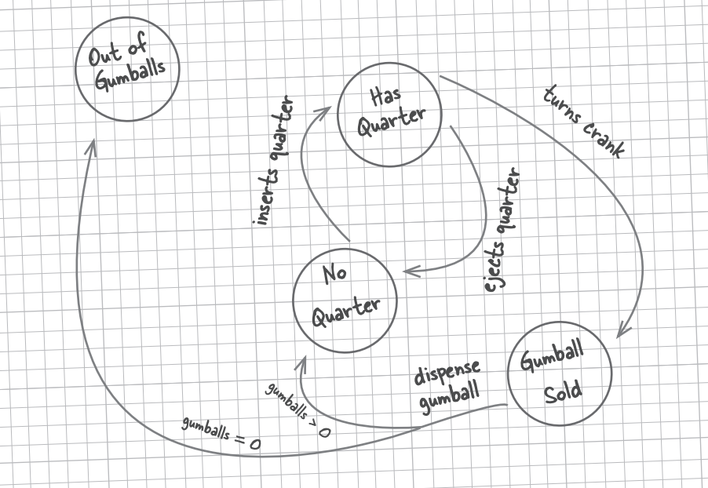

## **상태 패턴(State Pattern)**
상태를 객체화 하여 상태가 행동을 할 수 있도록 위암하는 패턴

#### 상태 패턴을 사용하면?
- 객체의 내부 상태가 바뀜에 따라서 객체의 행동을 바꿀 수 있습니다. (마치 객체의 클래스가 바뀌는 것과 같은 결과를 얻을 수 있습니다.)

### 옵저버 패턴의 구성 요소
- 상태 (State) : 상태를 추상화한 고수준 모듈
- 상태 구현체 (ConcreteState) : 구체적인 각각의 상태를 클래스로 표현한 것
- 컨텍스트(Context) : State를 이용하는 시스템


### 예제 (책 - Headfirst Design Pattern 참조)


### 상태 패턴 적용 전
```java
public class GumballMachine {
    final static int SOLD_OUT = 0;
    final static int NO_QUARTER = 1;
    final static int HAS_QUARTER = 2;
    final static int SOLD = 3;

    int state = SOLD_OUT;
    int count = 0;

    public GumballMachine(int count) {
        this.count = count;
        if(count > 0) {
            state = NO_QUARTER;
        }
    }

    public void insertQuarter() {
        if(state == HAS_QUARTER){     
            System.out.println("동전은 한개만 넣어주세요");
        }else if(state == SOLD_OUT){      
            System.out.println("매진되었습니다. 다음 기회에 이용해주세요.");
        }else if(state == SOLD){   
            System.out.println("잠깐만 기다려 주세요. 알맹이가 배출되고 있습니다.") 
        }
        else if(state == NO_QUARTER) {        
            state = HAS_QUARTER       
            System.out.println("동전이 투입 되었습니다.");                     
        }
    }

    public void ejectQuarter() {
        //...
    }

    public void turnCrank() {
        //...
    }

    public void dispense() {
        //...
    }
}
```
### 상태 패턴 적용 후
```java
public interface State {
    void insertQuarter();
    void ejectQuarter();
    void turnCrank();
    void dispense();
}

public class NoQuerterState implements State {
	GumballMachineOop m_gumballMachine;
	public NoQuerterState(GumballMachineOop gumballMachine) {
		m_gumballMachine = gumballMachine;
	}
	
	@Override
	public void insertQuerter() {
		System.out.println("동전을 넣었습니다.");
		m_gumballMachine.setState(m_gumballMachine.getHasQuerterState());
	}

	@Override
	public void ejectQuerter() {
		System.out.println("도둑놈아! 동전을 넣고 반환버튼을 눌러라!");
	}

	@Override
	public void turnCrank() {
		System.out.println("돈을 넣기전에 알맹이를 줄 수 없다!");
	}

	@Override
	public void dispense() {
		System.out.println("돈을 넣기전에 알맹이를 줄 수 없다!");
	}

	@Override
	public String toString() {
		return new String("동전 투입 대기중");
	}
}

public class HasQuerterState implements State {
	GumballMachineOop m_gumballMachine;

	public HasQuerterState(GumballMachineOop gumballMachine) {
		m_gumballMachine = gumballMachine;
	}
	
	@Override
	public void insertQuerter() {
		System.out.println("동전을 하나만 넣어주세요.");
	}

	@Override
	public void ejectQuerter() {
		System.out.println("동전 반환.");
		m_gumballMachine.setState(m_gumballMachine.getNoQuerterState());
	}

	@Override
	public void turnCrank() {
		System.out.println("손잡이를 돌림.");
		m_gumballMachine.setState(m_gumballMachine.getSoldState());
	}

	@Override
	public void dispense() {
		System.out.println("손잡이를 돌려야 알맹이가 나옵니다.");
	}

	@Override
	public String toString() {
		return new String("동전 투입 된 상태");
	}
}

public class SoldState implements State {

	GumballMachineOop m_gumballMachine;

	public SoldState(GumballMachineOop gumballMachine) {
		m_gumballMachine = gumballMachine;
	}
	
	@Override
	public void insertQuerter() {
		System.out.println("알맹이가 나가고 있습니다. 잠깐 기다리세요.");
	}

	@Override
	public void ejectQuerter() {
		System.out.println("이미 알맹이를 뽑았잖아! 돈은 못 줘!");
	}

	@Override
	public void turnCrank() {
		System.out.println("손잡이를 한 번만 돌려주세요!");
	}

	@Override
	public void dispense() {
		m_gumballMachine.releaseBall();
		if (m_gumballMachine.getCount() > 0) {
			m_gumballMachine.setState(m_gumballMachine.getNoQuerterState());
		}
		else {
			m_gumballMachine.setState(m_gumballMachine.getSoldOutState());
		}
	}

	@Override
	public String toString() {
		return new String("판매 중");
	}
}

public class SoldOutState implements State {

	GumballMachineOop m_gumballMachine;

	public SoldOutState(GumballMachineOop gumballMachine) {
		m_gumballMachine = gumballMachine;
	}

	@Override
	public void insertQuerter() {
		System.out.println("이미 다 팔림.");
	}

	@Override
	public void ejectQuerter() {
		System.out.println("돈을 넣고 돌려라! 줄 돈 없어!");
	}

	@Override
	public void turnCrank() {
		System.out.println("돈을 넣고 돌려라! 그리고 이미 다 팔렸다.");
	}

	@Override
	public void dispense() {
		System.out.println("매진됐고, 돈도 안넣고 손잡이도 안돌려서 알맹이 못 줌.");
	}

	@Override
	public String toString() {
		return new String("매진");
	}
}
```

#### 메인
```java
public class GumballMachineOop {
	State m_soldOutState;
	State m_noQuerterState;
	State m_hasQuerterState;
	State m_soldState;
	
	State m_state = m_soldOutState;
	int m_count = 0;
	
	public GumballMachineOop(int numberGumballs) {
		m_count = numberGumballs;
		if (numberGumballs > 0) {
			m_state = m_noQuerterState;
		}
	}
	
	/**
	 * 동전 삽입
	 */
	public void insertQuerter() {
		m_state.insertQuerter();
	}
	
	/**
	 * 동전 반환
	 */
	public void ejectQuerter() {
		m_state.ejectQuerter();
	}
	
	/**
	 * 손잡이를 돌림
	 */
	public void turnCrank() {
		m_state.turnCrank();
		m_state.dispense();
	}

	void setState(State state) {
		m_state = state;
	}
	
	void releaseBall() {
		System.out.println("A gumball comes rolling out the slot...");
		if (m_count != 0) {
			m_count--;
		}
	}

	public State getSoldOutState() {
		return m_soldOutState;
	}

	public State getNoQuerterState() {
		return m_noQuerterState;
	}

	public State getHasQuerterState() {
		return m_hasQuerterState;
	}

	public State getSoldState() {
		return m_soldState;
	}
	
	public int getCount() {
		return m_count;
	}

	public State getState() {
		return m_state;
	}

	@Override
	public String toString() {
		return new String(String.format("남은 개수: %d, %s", m_count, m_state));
	}
}
```

