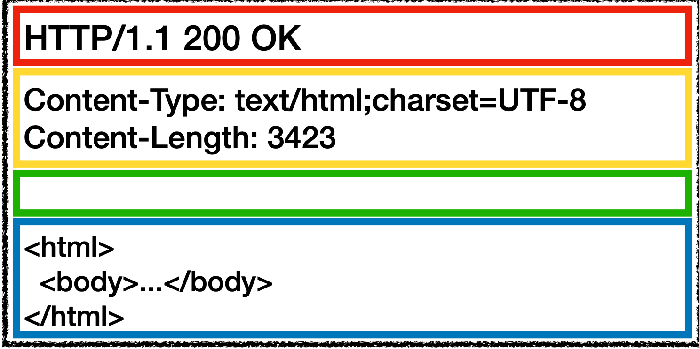
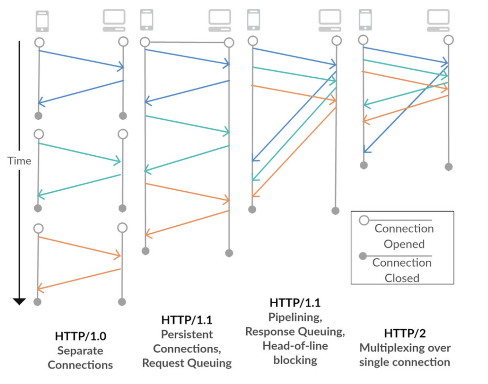

# HTTP (HyperText Transfer Protocol)
#### 웹에서 정보를 주고받을 수 있는 프로토콜

- HTTP 요청 메세지

- HTTP 응답 메세지

## HTTP 발전 과정
HTTP/0.9 -> HTTP/1.0 -> HTTP/1.1 -> HTTP/2 -> HTTP/3 순으로 발전이 되어 왔음

## HTTP/0.9
- 초기 HTTP 프로토콜은 단일 라인으로 구성
- 가능한 메서드는 GET 밖에 없음
- Header 개념이 없고, HTML 파일만 전송이 가능
<table>
    <th style="text-align:center">요청</th>
    <th></th>
    <th style="text-align:center">응답</th>
    <tr>
        <td>
            <image src='../images/http_0_9_request.png' width='300' height='150'>
        </td>        
        <td><>
        </td>    
        <td>
            <image src='../images/http_0_9_response.png' width='300' height='150'>
        </td>    
    </tr>
</table>

## HTTP/1.0
- 요청에 버전 정보가 붙어서 전송
- 응답 시작 부분에 상태 코드가 추가
- 모든 요청과 응답에 헤더 개념이 추가
<table>
    <th style="text-align:center">요청</th>
    <th></th>
    <th style="text-align:center">응답</th>
    <tr>
        <td>
            <image src='../images/http_1_0_request.png' width='300' height='180'>
        </td>        
        <td><>
        </td>    
        <td>
            <image src='../images/http_1_0_response.png' width='300' height='180'>
        </td>    
    </tr>
</table>

## HTTP/1.1
- Connection Keep-Alive 기능 추가
- 파이프라이닝 추가 (이전 요청에 완전히 전송되기 전에 다음 전송 기능 수행)
- 청크된 응답 지원
- 캐시 제어 매커니즘
- 언어, 인코딩 타입등을 포함한 컨텐츠 전송
- Host 헤더를 통한 동일 IP 주소에 다른 도메인을 호스트하는 기능 가능

<table>
    <th style="text-align:center">요청</th>
    <th></th>
    <th style="text-align:center">응답</th>
    <tr>
        <td>
            <image src='../images/http_1_1_request.png'>
        </td>        
        <td><>
        </td>    
        <td>
            <image src='../images/http_1_1_response.png'>
        </td>    
    </tr>
</table>

## HTTP/2.0
- 멀티플렉싱 기능 추가 (한 커넥션으로 병렬 처리 및 응답 가능)
- 헤더 압축 기능 추가
- 서버 푸시 메커니즘 추가 (요청하지 않은 리소스도 보낼 수 있게 됨)

#### HTTP/2.0은 여전히 TCP를 이용해 handshake로 인한 지연시간과 TCP의 HOLB 문제 해결 불가   일반적으로 3RTT가 필요 (TCP + TLS)

## HTTP/3.0
- UDP 기반의 통신 (3 way handshaking 불필요)
- 연결 설정에 필요한 정보와 함께 데이터를 보냄
- 한번 연결되면 정보들을 캐싱하고 있다가, 0 RTT만에 연결