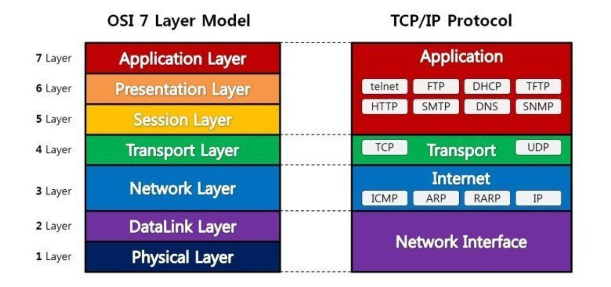
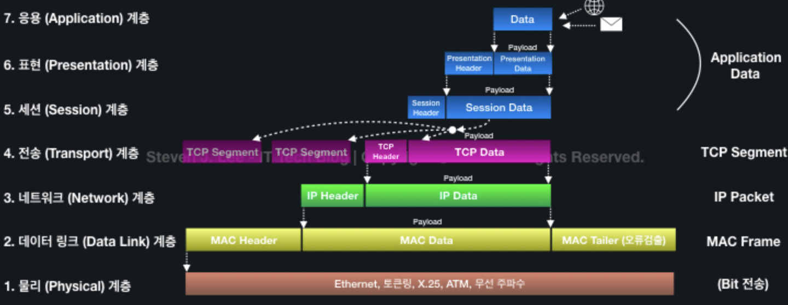

# OSI 7 계층 & TCP/IP 4계층

## OSI 7계층
- 정의 : 통신이 일어나는 과정을 7단계로 정의한 국제 통신 표준 규약

### 1계층 (Physical Layer)
- 데이터를 전기적인 신호로 변환해서 주고받는 기능을 진행하는 공간
- 장비 : 통신 케이블, 리피터, 허브, 모뎀등을 사용
- 데이터 단위 : 비트(bit)

#### 1 계층은 데이터 전달만 담당, 어떤 에러가 있는지는 관여하지 않음 (대역폭과 전송효율이 중요)

### 2계층 (Data Link Layer)
- 직접 연결된 서로 다른 2개의 네트워크 장치 간의 데이터 전송을 담당하는 계층
- 장비 : 브릿지, 스위치
- 단위 : 프레임(frame)

### 주요역할 
- 프레이밍 : 물리 계층의 신호를 조합하여 프레임 단위의 정해진 크기의 데이터 유닛으로 만듬 
- 흐름 제어 : 너무 많거나 너무 적게 데이터를 송수신 하지 않도록 흐름을 적절히 제어 
- 오류 제어 : 프레임 전송 시에 발생한 오류를 복원하거나 재전송 
- 접근 제어 : 매체 상에 통신 주체가 여럿 존재할 때, 데이터 전송 여부를 결정 (Mac 주소 이용) 

#### 2 계층은 효율적인 데이터 전송과 충돌 관리, 오류 제어 등에 중점

### 3계층 (Network Layer)
- 데이터를 목적지까지 가장 안전하고 빠르게 전달하는 기능(라우팅)을 담당
- 장비 : 라우터
- 단위 : 패킷(Packet)

### 주요역할 
- 라우팅 : 여러 경로 중에서 최적의 경로를 선택하여 데이터를 전송
- 흐름 제어 : 데이터의 과다한 양이 한 번에 전송되는 것을 방지하여 네트워크 혼잡을 예방 (ex.슬라이딩 윈도우)
- 오류 처리 : 네트워크에서 발생하는 데이터 전송 중에 발생하는 오류를 검출하고 복구하는 프로세스 (ex. CRC, 순서 번호)

### 4계층 (Transport Layer)
- 두 호스트 시스템으로부터 발생하는 데이터의 흐름을 제공
- 단위 : 세그먼트

#### 대표적인 프로토콜은 TCP(연결 지향성), UDP(비연결 지향성)가 있음
### 주요역할 
- 신뢰성 있는 전송 (TCP)
- 흐름 제어
- 포트번호 사용

### 5계층 (Session Layer)
- 통신 시스템 사용자 간의 연결을 유지 및 설정 (데이터가 통신하기 위한 논리적 연결 담당)
- API, Socket

### 6계층 (Presentation Layer)
- 세션 계층 간의 주고받는 인터페이스를 일관성이 있게 제공한다.

### 주요역할 
- 데이터 표현에 대한 독립성 제공
- 암호화, 인코딩 등 ㄷ마당
- JPEG, MPEG 등

### 7계층 (Application Layer)
- 최종 목적지로, 응용 프로세스와 직접 관게하여 일반적인 응용 서비스를 수행한다.

### 주요역할 
- 인증과 보안, 네트워크 접근제어 등의 기능 제공
- 사용자 인터페이스, 전자우편, 데이터베이스 관리 등의 서비스 제공
- HTTP, SMTP, FTP 등

 

