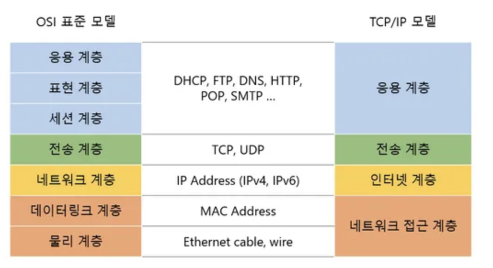

# TCP/IP 4 계층

## TCP/IP 4 계층
- 정의 : 네트워크 통신을 위한 프로토콜을 계층적으로 나눈 것

### 1계층 (Network Access Layer)
- MAC Address : 물리적인 네트워크와의 상호작용을 위함
- OSI 7계층의 데이터 링크 계층 + 물리 계층을 합친 것
- 장비 : L2 스위치

### 2계층 (Internet Layer)
- 논리적인 네트워크와의 상호작용을 위함
- IP : 통신자의 호스트를 식별하기 위함
- 장비 : L3 스위치, 라우터

### 3계층 (Transport Layer)
- 종단간 통신을 관리
- TCP/UDP : 연결지향(TCP) 및 비연결지향(UDP) 관련 통신 프로토콜
- 장비 : L3 스위치, 라우터

### 4계층 (Application Layer)
- 최종 사용자에게 서비스를 제공하는 계층
- HTTP, FTP, SMTP 등..
- 장비 : 앱 등

# 웹 동작 방식 (만약, www.naver.com을 검색 했다면?)

1. 우리 브라우저는 www.naver.com의 주소(IP)를 모른다. (이 과정에서, DNS 서버는 DNS Query를 통한 네이버 주소를 가져온다.)
2. DNS 서버로부터 IP주소를 얻어 온다.
3. TCP 연결을 맺고, TCP Connection을 생성한다.
4. TCP를 통한 데이터를 송수신 한다.
5. TCP 연결을 끊는다.